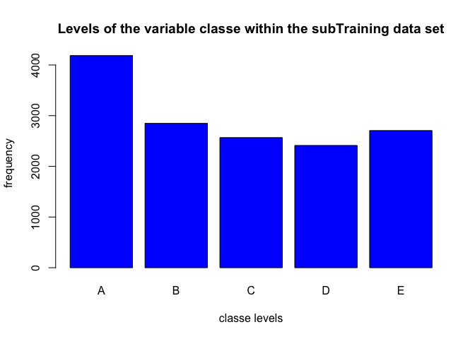
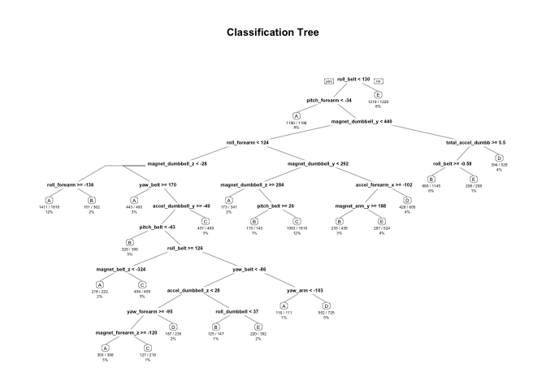

# Practical Machine Learning Course Project
Alexander Dolinin  
July 19, 2015  

##Assignment
Using devices such as *Jawbone Up, Nike FuelBand, and Fitbit* it is now possible to collect a large amount of data about personal activity relatively inexpensively. These type of devices are part of the quantified self movement – a group of enthusiasts who take measurements about themselves regularly to improve their health, to find patterns in their behavior, or because they are tech geeks. One thing that people regularly do is quantify how *much* of a particular activity they do, but they rarely quantify *how well* they do it. In this project, your goal will be to use data from accelerometers on the belt, forearm, arm, and dumbell of 6 participants. They were asked to perform barbell lifts correctly and incorrectly in 5 different ways. More information is available from the website here:  [http://groupware.les.inf.puc-rio.br/har](http://groupware.les.inf.puc-rio.br/har).

The training data for this project are available   [https://d396qusza40orc.cloudfront.net/predmachlearn/pml-training.csv](https://d396qusza40orc.cloudfront.net/predmachlearn/pml-training.csv) and the tests data [https://d396qusza40orc.cloudfront.net/predmachlearn/pml-testing.csv](https://d396qusza40orc.cloudfront.net/predmachlearn/pml-testing.csv).
The data for this project come from this source: [http://groupware.les.inf.puc-rio.br/har](http://groupware.les.inf.puc-rio.br/har).

##Synopsis
A factor variable with 5 levels, *classe*, is the outcome variable. For this data set, “participants were asked to perform one set of 10 repetitions of the Unilateral Dumbbell Biceps Curl in 5 different fashions:

- exactly according to the specification (Class A)
- throwing the elbows to the front (Class B)
- lifting the dumbbell only halfway (Class C)
- lowering the dumbbell only halfway (Class D)
- throwing the hips to the front (Class E)

Class A corresponds to the specified execution of the exercise, while the other 4 classes correspond to common mistakes."
Prediction evaluations were based on maximizing the accuracy and minimizing the out-of-sample error. After some cleaning, all other variables were used for prediction.
Two models were tested using decision tree and random forest algorithms, and the model with the highest accuracy was chosen as the final model.

###Cross-validation
Cross-validation was performed by subsampling training data set randomly without replacement into 2 subsamples: subTraining data (75% of the original Training data set) and subTesting data (25%). Our models were fitted on the subTraining data set, and tested on the subTesting data. Once the most accurate model was choosen, it was tested on the original Testing data set.

###Expected out-of-sample error
The expected out-of-sample error corresponded to the quantity: 1-accuracy in the cross-validation data. Accuracy is the proportion of correct classified observation over the total sample in the subTesting data set. Expected accuracy is the expected accuracy in the out-of-sample data set (i.e. original testing data set). So, the expected value of the out-of-sample error corresponded to the expected number of missclassified observations/total observations in the Test data set, which is the quantity: 1-accuracy found from the cross-validation data set.

###Reasoning
The outcome variable *classe* is an unordered factor variable, so we could choose error type as 1-accuracy. The sample size is large, with N=19622 in the Training data set, which allowed us to divide Training sample into subTraining and subTesting to allow cross-validation. Features with all missing values and irrelevant features were discarded. All other features were kept as relevant variables.
Decision tree and random forest algorithms are known for their ability of detecting the features that are important for classification. Feature selection is inherent, so it is not necessary at the data preparation phase and is not included in this report.

##Code and Results
Code for this assignment has been written and tested in the following R version:

```
## Run time: 2015-07-19 22:41:32
## R version: R version 3.2.1 (2015-06-18)
```

###Required packages and seed

```r
#install.packages("caret")
#install.packages("randomForest")
#install.packages("rpart")
#install.packages("rpart.plot")

library(caret)
```

```
## Loading required package: lattice
## Loading required package: ggplot2
```

```r
library(randomForest) #Random forest for classification and regression
```

```
## randomForest 4.6-10
## Type rfNews() to see new features/changes/bug fixes.
```

```r
library(rpart) # Regressive Partitioning and Regression trees
library(rpart.plot) # Decision Tree plot
```
A pseudo-random number generator seed was set to 6789. In order to reproduce the results below, the same seed should be used.

```r
# set the seed for reproduceability
set.seed(6789)
```

###Data preparation
The data sets were saved into workign directory, ensuring that missing values were coded correctly: some missing values were entered as strings *"#DIV/0!"* or *""* or *"NA"* - these will be changed to *NA*. Both data sets contain columns wehre all values were missing - these were irrelevant and deleted.
Results were hidden from the report for clarity and space considerations.


```r
# Load data into the training dataset, replacing all missing with "NA"
trainingset <- read.csv("data/pml-training.csv", na.strings=c("NA","#DIV/0!", ""))

# Load data into the testing dataset 
testingset <- read.csv('data/pml-testing.csv', na.strings=c("NA","#DIV/0!", ""))

# Check dimensions for number of variables and number of observations
dim(trainingset)
dim(testingset)

# Delete columns with all missing values
trainingset<-trainingset[,colSums(is.na(trainingset)) == 0]
testingset <-testingset[,colSums(is.na(testingset)) == 0]

# These variables were irrelevant and deleted: user_name, raw_timestamp_part_1, raw_timestamp_part_,2 cvtd_timestamp, new_window, and  num_window (columns 1 to 7).
trainingset   <-trainingset[,-c(1:7)]
testingset <-testingset[,-c(1:7)]

# Prepared datasets:
dim(trainingset)
dim(testingset)
head(trainingset)
head(testingset)
```

###Partition the training dataset to allow cross-validation
The training data set contains 53 variables and 19622 obs.
The testing data set contains 53 variables and 20 obs.
For cross-validation, the training data set was partionned into 2 sets using random subsampling without replacement: subTraining (75%) and subTest (25%).


```r
subsamples <- createDataPartition(y=trainingset$classe, p=0.75, list=FALSE)
subTraining <- trainingset[subsamples, ] 
subTesting <- trainingset[-subsamples, ]
dim(subTraining)
dim(subTesting)
head(subTraining)
head(subTesting)
```

###Data exploration
The variable *classe* contains 5 levels: A, B, C, D and E. A plot of the outcome variable will allow us to see the frequency of each levels in the subTraining data set and compare one another.

```r
plot(subTraining$classe, col="blue", main="Levels of the variable classe within the subTraining data set", xlab="classe levels", ylab="frequency")
```

 
From the bar plot above, we can see that each level frequency is within the same order of magnitude of each other. Level A is the most frequent with more than 4000 occurrences, while level D is the least frequent with about 2500 occurrences.

###First prediction model, using Decision Tree

```r
model1 <- rpart(classe ~ ., data=subTraining, method="class")

prediction1 <- predict(model1, subTesting, type = "class")

# Plot of the Decision Tree
rpart.plot(model1, main="Classification Tree", extra=102, under=TRUE, faclen=0)
```

 

```r
# Test results on subTesting data set:
confusionMatrix(prediction1, subTesting$classe)
```

```
## Confusion Matrix and Statistics
## 
##           Reference
## Prediction    A    B    C    D    E
##          A 1282  149   15   52   26
##          B   44  589   72   78   78
##          C   38   98  704  121   91
##          D   10   71   45  487   57
##          E   21   42   19   66  649
## 
## Overall Statistics
##                                           
##                Accuracy : 0.7567          
##                  95% CI : (0.7445, 0.7687)
##     No Information Rate : 0.2845          
##     P-Value [Acc > NIR] : < 2.2e-16       
##                                           
##                   Kappa : 0.6913          
##  Mcnemar's Test P-Value : < 2.2e-16       
## 
## Statistics by Class:
## 
##                      Class: A Class: B Class: C Class: D Class: E
## Sensitivity            0.9190   0.6207   0.8234  0.60572   0.7203
## Specificity            0.9310   0.9312   0.9141  0.95537   0.9630
## Pos Pred Value         0.8412   0.6841   0.6692  0.72687   0.8143
## Neg Pred Value         0.9666   0.9110   0.9608  0.92513   0.9386
## Prevalence             0.2845   0.1935   0.1743  0.16395   0.1837
## Detection Rate         0.2614   0.1201   0.1436  0.09931   0.1323
## Detection Prevalence   0.3108   0.1756   0.2145  0.13662   0.1625
## Balanced Accuracy      0.9250   0.7759   0.8687  0.78054   0.8417
```

###Second prediction model, using Random Forest

```r
model2 <- randomForest(classe ~. , data=subTraining, method="class")

prediction2 <- predict(model2, subTesting, type = "class")

# Test results on subTesting data set:
confusionMatrix(prediction2, subTesting$classe) 
```

```
## Confusion Matrix and Statistics
## 
##           Reference
## Prediction    A    B    C    D    E
##          A 1392   10    0    0    0
##          B    3  933    6    0    0
##          C    0    6  849    7    0
##          D    0    0    0  797    1
##          E    0    0    0    0  900
## 
## Overall Statistics
##                                           
##                Accuracy : 0.9933          
##                  95% CI : (0.9906, 0.9954)
##     No Information Rate : 0.2845          
##     P-Value [Acc > NIR] : < 2.2e-16       
##                                           
##                   Kappa : 0.9915          
##  Mcnemar's Test P-Value : NA              
## 
## Statistics by Class:
## 
##                      Class: A Class: B Class: C Class: D Class: E
## Sensitivity            0.9978   0.9831   0.9930   0.9913   0.9989
## Specificity            0.9972   0.9977   0.9968   0.9998   1.0000
## Pos Pred Value         0.9929   0.9904   0.9849   0.9987   1.0000
## Neg Pred Value         0.9991   0.9960   0.9985   0.9983   0.9998
## Prevalence             0.2845   0.1935   0.1743   0.1639   0.1837
## Detection Rate         0.2838   0.1903   0.1731   0.1625   0.1835
## Detection Prevalence   0.2859   0.1921   0.1758   0.1627   0.1835
## Balanced Accuracy      0.9975   0.9904   0.9949   0.9955   0.9994
```

##Decision
As expected, Random Forest algorithm performed better than Decision Trees.
Accuracy for Random Forest model was 0.995 (95% CI: (0.993, 0.997)) compared to 0.739 (95% CI: (0.727, 0.752)) for Decision Tree model. The random Forest model is choosen. The accuracy of the model is 0.995. The expected out-of-sample error is estimated at 0.005, or 0.5%. The expected out-of-sample error is calculated as 1 - accuracy for predictions made against the cross-validation set. Our Test data set comprises 20 cases. With an accuracy above 99% on our cross-validation data, we can expect that very few, or none, of the test samples will be missclassified.

##Submission to Coursera

```r
# Use Random Forest algorithm to predict outcome levels on the original Testing dataset 
predictfinal <- predict(model2, testingset, type="class")
predictfinal
```

```
##  1  2  3  4  5  6  7  8  9 10 11 12 13 14 15 16 17 18 19 20 
##  B  A  B  A  A  E  D  B  A  A  B  C  B  A  E  E  A  B  B  B 
## Levels: A B C D E
```


```r
# Write files for submission to Coursera
pml_write_files = function(x){
  n = length(x)
  for(i in 1:n){
    filename = paste0("problem_id_",i,".txt")
    write.table(x[i],file=filename,quote=FALSE,row.names=FALSE,col.names=FALSE)
  }
}

pml_write_files(predictfinal)
```
